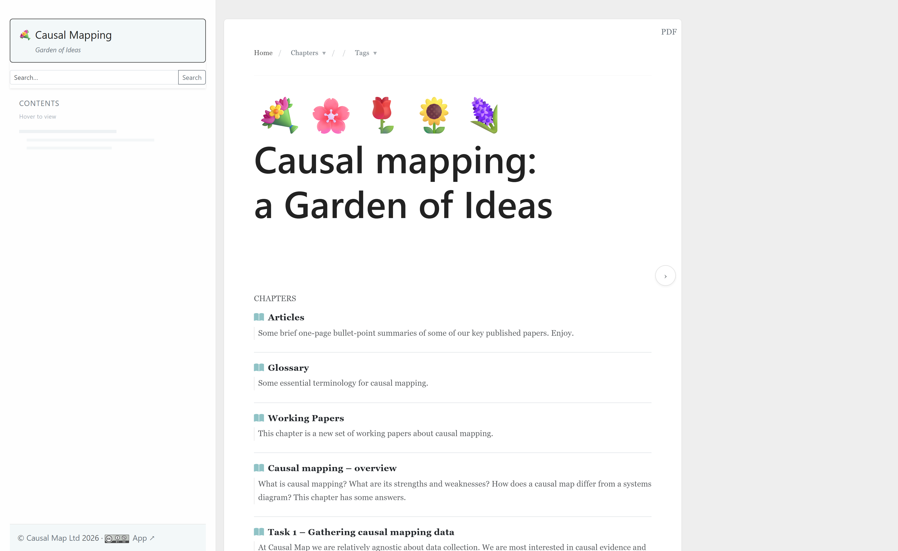
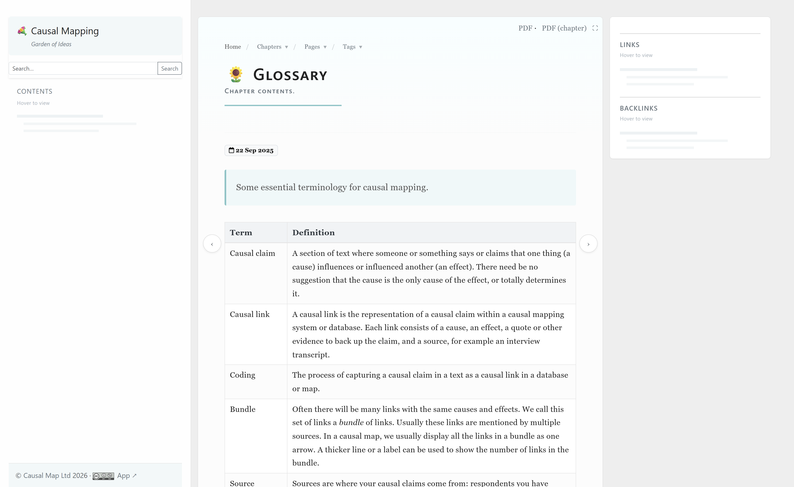

# Causal Map Garden

A public knowledge garden about causal mapping in evaluation and research.

**Live site: [garden.causalmap.app](https://garden.causalmap.app)**

The garden is a growing collection of notes, working papers and case studies run by [Causal Map Ltd](https://causalmap.app). It explains the method, shares worked examples, and supports people using the [Causal Map app](https://app.causalmap.app). Pages cover the theory, how-to guides, and applied case studies.

---

## For readers

Everything lives at **[garden.causalmap.app](https://garden.causalmap.app)**. Open the chapter menu at the top, or browse from the home page.



Each page reads like a short article. The left sidebar holds search and a contents list. On wide screens the right sidebar shows links and backlinks between pages, so you can follow an idea across the garden. Many pages can be downloaded as a PDF from the link at the top right.



That is all a reader needs. The rest of this file is for anyone who wants to look under the bonnet or fork the build tool.

---

## For developers

This repo holds a small static-site generator and the site it produces. It is bespoke tooling, built for our own Obsidian vault and shared as is. It is not a packaged product, so expect a few Causal Map specifics baked in (see [Adapting it](#adapting-it-for-your-own-vault) below).

### How it works

Content is written as Markdown in an [Obsidian](https://obsidian.md) vault under `content/`. A single Python script reads the vault and writes a complete static HTML site into `dist/`. [Netlify](https://www.netlify.com) serves `dist/` directly; its build command is blank because the site is built locally and committed ready to serve.

```
content/              Obsidian vault, all source Markdown (local only, see note below)
dist/                 Generated HTML site, the Netlify publish target
build_static_site.py  The generator (one file)
config.yml            Site config: title, URL, analytics, footer links
watch_and_build.ps1   Watcher: rebuilds after a change, commits and pushes dist/
run_build_scheduled.bat  Full clean rebuild, run daily by Task Scheduler
serve.py              Local preview server
netlify.toml          Netlify config (publish = "dist")
```

**Note on what is committed.** This repo uses an allowlist `.gitignore`. Only `dist/`, the build scripts, `config.yml`, `netlify.toml` and this README are tracked. The `content/` vault is deliberately kept local and is not pushed to GitHub, so you will not find the source Markdown here.

### Requirements

- Python 3.10 or newer
- `pip install markdown pyyaml beautifulsoup4`
- Optional, for PDF export: `pip install playwright` then `playwright install chromium`

The generator renders PDFs by printing each page through headless Chromium. Without Playwright installed the site still builds; only the PDF outputs are skipped.

### Build

```bash
# Incremental build (normal use): only rebuild changed or new pages
python build_static_site.py --incremental

# Incremental, with per-page PDFs for changed files only
python build_static_site.py --incremental --page-pdf

# Full clean rebuild, including all PDFs
python build_static_site.py --clean --pdf

# Local preview at http://localhost:8000
python serve.py
```

The watcher (`watch_and_build.ps1`) monitors `content/`, rebuilds about a minute after a change, then runs `git add dist`, commits and pushes, which triggers a Netlify deploy. PDFs are expensive, so per-page PDFs rebuild only when missing or when their source Markdown is newer.

### Main flags

| Flag | Effect |
|------|--------|
| `--input PATH` | Obsidian content folder (default `./content`; usually set in `config.yml`) |
| `--output PATH` | Output folder (default `./generated_site`; `config.yml` sets `./dist`) |
| `--config PATH` | Path to a `config.yml` |
| `--incremental` | Rebuild only changed or new files |
| `--incremental-strict-pipeline` | With `--incremental`, rebuild every page after a pipeline or nav change (the watcher uses this) |
| `--clean` | Empty the output folder first, for a full rebuild |
| `--page-pdf` | Also build per-page PDFs for changed files |
| `--chapters-pdf` | Also build one PDF per top-level chapter folder |
| `--pdf` | Build both page and chapter PDFs |
| `--bib PATH` | BibTeX library used to format citations and reference lists |
| `--missing` | Print warnings for missing images and links |
| `--timing` | Print a timing breakdown of the build |

### Authoring conventions

The vault uses a few naming and syntax rules that the build understands:

- Only folders starting with a digit are published, for example `005 Topic/`.
- A folder whose name contains `!` is skipped entirely.
- A filename containing `!` is a draft: built for local preview but kept out of nav, search and PDF output.
- `((anchor))` at the end of a filename gives the page a short URL `/anchor/`.
- In filenames, `--` becomes an en dash and `qq` becomes `?`.
- YAML front matter is stripped; the filename becomes the page title.
- Wiki links use bare basenames, for example `[[page title|display]]`, resolved across the vault.
- Pandoc citation keys such as `[@powellCausalMappingEvaluators2024]` are formatted into APA style with an automatic reference list, using the `--bib` library.
- Page styling (paper and case-study layouts, banner and rounded heading classes, two-column sections, image sizing) is driven from YAML tags and Pandoc-style classes on headings.

Under the hood it is plain [Python-Markdown](https://python-markdown.github.io/) with the `extra`, `fenced_code`, `tables`, `attr_list`, `footnotes` and `toc` extensions, plus a set of preprocessors for the Obsidian-specific syntax (callouts, wiki links, highlights, MathJax and Mermaid fences, column blocks).

### Adapting it for your own vault

Most site identity is in `config.yml`: title, subtitle, `site_url`, footer links, OG image and analytics IDs. Point `input` at your own vault, change those values, and most of the output rebrands itself.

A handful of Causal Map specifics are still hardcoded in `build_static_site.py`, so search for and remove these if you fork:

- Deep links into `app.causalmap.app/help-docs` and the "Causal Map Ltd / app" link normalisation.
- The "Causal Map Garden" label on PDF chapter title pages and the page footer link.
- The `--readme` option, which splits an external app README into a final chapter, points at a local path.

The generator is a single 8,000-line file with no test suite, written for one site. It is shared in case the approach is useful, not as a maintained framework.
